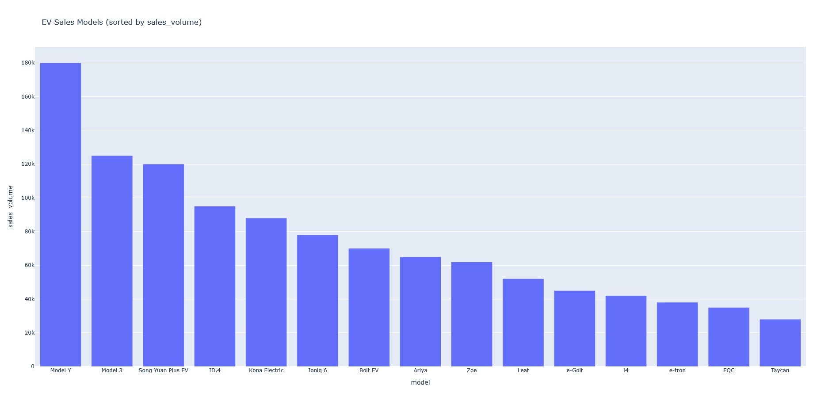

# ev-market-analysis

# 🚗 Electric Vehicle (EV) Market Analysis
[](https://www.python.org/)
[](https://opensource.org/licenses/MIT)

## 🌟 Overview
This project provides a comprehensive analysis of the Global Electric Vehicle market. By processing raw sales and technical data, the system identifies pricing trends and manufacturer performance. This tool is designed to help automotive engineers and stakeholders make data-driven decisions regarding market positioning.

## 🎯 Key Objectives
* **Data Automation:** Streamlining the ingestion of JSON and CSV data formats.
* **Exploratory Data Analysis (EDA):** Identifying price-to-range correlations across different EV brands.
* **Interactive Visualization:** Creating web-based dashboards for stakeholder reporting.

## 🛠️ Tech Stack
* **Language:** Python 3.12
* **Libraries:** * `Pandas`: High-performance data manipulation and cleaning.
    * `Plotly`: Interactive web-based visualizations.
    * `NumPy`: Numerical computation for pricing metrics.

## 📂 Project Structure
```text
├── data/               # Raw datasets (JSON/CSV) and exported reports
├── notebooks/          # Jupyter Notebooks for experimental analysis
├── src/                # Modular source code (Loader, Processing, Visualization)
│   ├── load.py         # Data ingestion logic
│   ├── processing.py   # Data cleaning and transformation
│   └── visualization.py # Chart generation functions
├── requirements.txt    # Project dependencies
└── README.md           # Project documentation